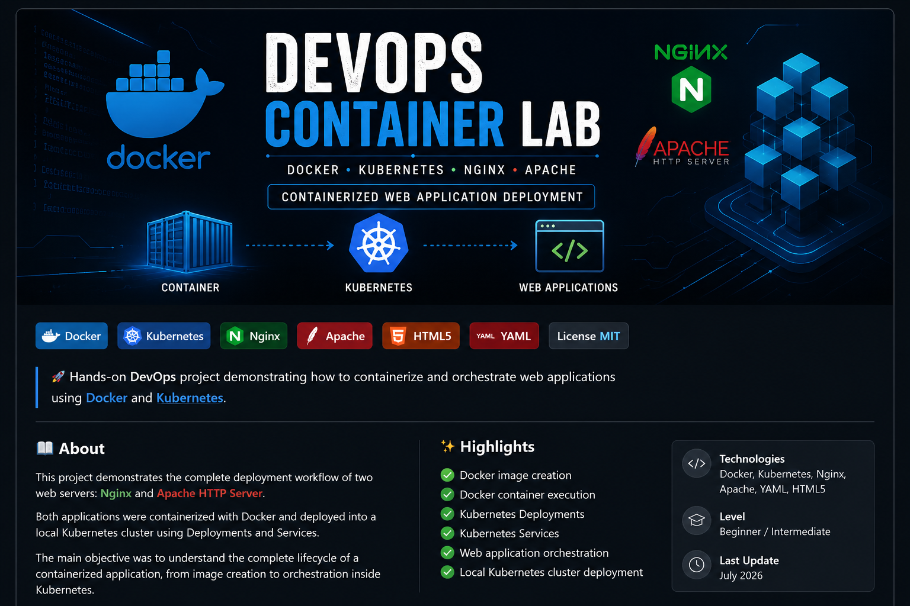

<p align="center">
  
</p>

<h1 align="center">🚀 DevOps Container Lab</h1>

<p align="center">
  Hands-on DevOps project demonstrating how to containerize and orchestrate web applications using Docker and Kubernetes.
</p>

<p align="center">
  
  
  
  
  
  
</p>

# 🚀 DevOps Container Lab


A hands-on DevOps project demonstrating how to containerize and orchestrate web applications using **Docker** and **Kubernetes**.

---

# 📖 About

This project demonstrates the complete deployment workflow of two web servers:

- **Nginx**
- **Apache HTTP Server**

Both applications were containerized with Docker and deployed into a local Kubernetes cluster using Deployments and Services.

The main objective was to understand the complete lifecycle of a containerized application, from image creation to orchestration inside Kubernetes.

---

# 🏗 Project Architecture

```text
                 Docker
 ┌────────────────────────────┐
 │       Dockerfile           │
 └──────────────┬─────────────┘
                │
                ▼
          Docker Image
                │
                ▼
        Docker Container
                │
                ▼
             Kubernetes
                │
                ▼
               Pod
                │
                ▼
          Deployment
                │
                ▼
             Service
                │
                ▼
             Browser
```

---

# 🛠 Technologies

- Docker
- Kubernetes
- Docker Desktop
- Nginx
- Apache HTTP Server
- YAML
- HTML5

---

# 📂 Project Structure

```text
devops-container-lab
│
├── apache
│   ├── Dockerfile
│   └── index.html
│
├── nginx
│   ├── Dockerfile
│   └── index.html
│
├── kubernetes
│   ├── apache-deployment.yaml
│   ├── apache-service.yaml
│   ├── nginx-deployment.yaml
│   └── nginx-service.yaml
│
└── README.md
```

---

# ⚙️ Features

- Docker image creation
- Docker container execution
- Kubernetes Deployments
- Kubernetes Services
- Web application orchestration
- Local Kubernetes cluster deployment

---

# 🚀 Running with Docker

## Build Nginx

```bash
docker build -t web-nginx ./nginx
```

## Build Apache

```bash
docker build -t web-apache ./apache
```

## Run Nginx

```bash
docker run -d --name nginx-container -p 8090:80 web-nginx
```

Access:

```
http://localhost:8090
```

---

## Run Apache

```bash
docker run -d --name apache-container -p 8091:80 web-apache
```

Access:

```
http://localhost:8091
```

---

# ☸️ Running with Kubernetes

Apply all manifests:

```bash
kubectl apply -f kubernetes/
```

Verify Deployments:

```bash
kubectl get deployments
```

Verify Pods:

```bash
kubectl get pods
```

Verify Services:

```bash
kubectl get services
```

---

## Nginx

```bash
kubectl port-forward service/nginx-service 8082:8080
```

Open:

```
http://localhost:8082
```

---

## Apache

```bash
kubectl port-forward service/apache-service 8083:8081
```

Open:

```
http://localhost:8083
```

---

# 📚 What I Learned

Throughout this project I gained practical experience with:

- Dockerfiles
- Docker Images
- Containers
- Kubernetes Pods
- Deployments
- Services
- YAML configuration
- Local Kubernetes clusters
- Application orchestration
- Container networking
- DevOps fundamentals

---

# 🔮 Future Improvements

- Ingress Controller
- ConfigMaps
- Secrets
- Persistent Volumes
- Horizontal Pod Autoscaler
- CI/CD with GitHub Actions
- Cloud deployment (Azure or AWS)

---

# 👨‍💻 Author

**Carlos Eduardo da Costa Freire**

Software Developer in Training

📧 carloseduardofreire118@gmail.com

🔗 GitHub: https://github.com/eucarlosz

---
⭐ If you found this project useful, feel free to leave a star.